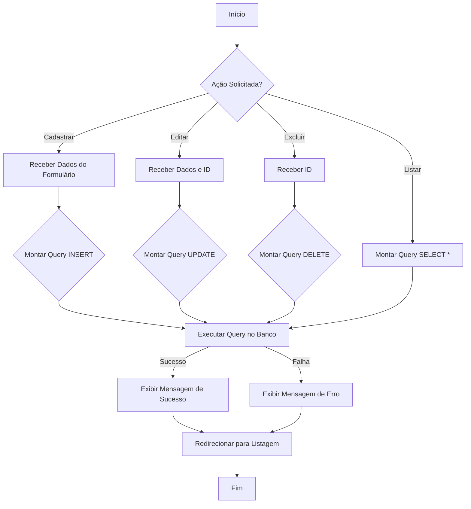

```mermaid
graph TD
    A[Início] --> B{Ação Solicitada?};
    B -- Cadastrar --> C[Receber Dados do Formulário];
    B -- Editar --> D[Receber Dados e ID];
    B -- Excluir --> E[Receber ID];
    B -- Listar --> F[Montar Query SELECT *];

    C --> G{Montar Query INSERT};
    D --> H{Montar Query UPDATE};
    E --> I{Montar Query DELETE};

    G --> J[Executar Query no Banco];
    H --> J;
    I --> J;
    F --> J;

    J -- Sucesso --> K[Exibir Mensagem de Sucesso];
    J -- Falha --> L[Exibir Mensagem de Erro];

    K --> M[Redirecionar para Listagem];
    L --> M;

    M --> N[Fim];
```
